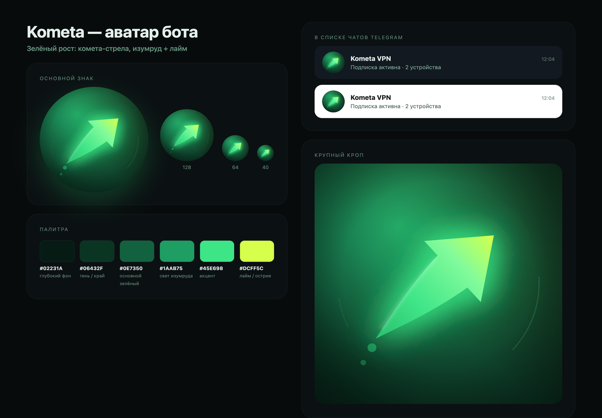

# Kometa — бренд-ассеты

Аватар для Telegram-бота: **зелёный рост**. Знак — комета-стрела: конусный хвост
кометы переходит в наконечник роста, изумруд у хвоста → лайм на острие.

Сделано в Open Design (`/Applications/Open Design.app`) через headless-экспорт:
исходник — HTML+SVG артефакт, растеризует встроенный Chromium на 2000×2000,
дальше кроп в центр и аккуратный даунсемпл.



## Что брать

| Файл | Зачем |
|---|---|
| [avatar/kometa-avatar-512.png](avatar/kometa-avatar-512.png) | **основной** — фото бота в @BotFather |
| [avatar/kometa-avatar-512.jpg](avatar/kometa-avatar-512.jpg) | то же в JPEG, если BotFather капризничает |
| [avatar/kometa-avatar-1024.png](avatar/kometa-avatar-1024.png) | мастер для печати, канала, обложек |
| [avatar/kometa-avatar-256.png](avatar/kometa-avatar-256.png) | аватар канала, доки, письма |
| [avatar/kometa-avatar-round-512.png](avatar/kometa-avatar-round-512.png) | круг с прозрачным фоном — сайт, README, презентации |
| [avatar/kometa-avatar.svg](avatar/kometa-avatar.svg) | векторный исходник (правится в Figma/Illustrator) |
| [avatar/preview.png](avatar/preview.png) | лист превью: размеры, палитра, мокап списка чатов |
| [avatar/alternates/](avatar/alternates) | два альтернативных концепта (см. ниже) |
| [banner/kometa-welcome-1280x720.png](banner/kometa-welcome-1280x720.png) | **баннер приветствия** — фото в первом сообщении бота |
| [banner/kometa-intro.mp4](banner/kometa-intro.mp4) | он же анимацией 6 с (первое сообщение / закреп) |
| [banner/kometa-intro-storyboard.png](banner/kometa-intro-storyboard.png) | раскадровка анимации по кадрам |
| [banner/kometa-channel-cover-1280x720.png](banner/kometa-channel-cover-1280x720.png) | обложка канала |

## Как поставить

1. Открыть [@BotFather](https://t.me/BotFather) → `/setuserpic` → выбрать бота → отправить
   `brand/avatar/kometa-avatar-512.png`.
2. Аватар канала: настройки канала → фото → `kometa-avatar-256.png` (или `-1024.png`).
3. Telegram сам обрежет картинку в круг — весь смысл знака умещается в центральные
   ~80 % кадра, поэтому в круглом кропе ничего не режется.

## Палитра

| HEX | Роль |
|---|---|
| `#02231A` | глубокий фон (край круга) |
| `#06432F` | тень, край градиента |
| `#0E7350` | основной зелёный |
| `#1AAB75` | свет изумруда, верхний левый угол |
| `#45E698` | акцент, тело знака |
| `#DCFF5C` | лайм — острие стрелы, «рост» |

Градиент знака: `#2BC57F → #45E698 → #8FF8AA → #DCFF5C`.
Фон: радиальный `#1AAB75 → #0E7350 → #06432F → #02231A` (центр 34 %/26 %).

## Баннеры и анимация

Баннер приветствия (`banner/kometa-welcome-1280x720.png`) — то, что бот отправляет первым
сообщением: картинка + подпись. Анимация (`banner/kometa-intro.mp4`, 6 с, 1920×1080, 30 fps,
H.264) — тот же макет, где комета-стрела влетает слева-снизу, а текст и чипы появляются
по очереди; дальше свечение «дышит». Отправляется как `sendAnimation` — Telegram проигрывает
её сам и зацикливает.

Анимацию рендерит HyperFrames внутри Open Design: исходник — HTML+GSAP-таймлайн
(`source/comet-intro.html`), растеризация в Chromium и кодирование в MP4 там же.

```bash
# положить композицию в проект Open Design и отрендерить
cp brand/source/comet-intro.html "$OD_DATA/projects/kometa-brand/.hyperframes-cache/comet-intro/index.html"
OD="node \"/Applications/Open Design.app/Contents/Resources/app/prebundled/daemon/daemon-cli.mjs\""
$OD media scaffold --composition-dir .hyperframes-cache/comet-intro --project kometa-brand
$OD media generate --surface video --model hyperframes-html --project kometa-brand \
  --composition-dir .hyperframes-cache/comet-intro --output kometa-intro.mp4
```

## Альтернативы

| Концепт | Файл | Идея |
|---|---|---|
| **A · Comet Arrow** (выбран) | `avatar/kometa-avatar-*` | комета-стрела: рост + скорость, тёмный изумруд |
| B · Growth Bars | `avatar/alternates/kometa-bars-*` | светлый mint, восходящие столбцы и росток — дружелюбнее |
| C · Monogram K | `avatar/alternates/kometa-monogram-*` | монограмма K со стрелой — узнаваемость бренда |

## Пересобрать

```bash
bash brand/tools/build_avatar.sh          # нужен запущенный Open Design
```

Скрипт копирует исходники из `brand/source/` в проект Open Design `kometa-brand`,
рендерит их Chromium'ом и нарезает PNG/JPEG/SVG в `brand/avatar/`.
Анти-слоп линтер Open Design на всех трёх артефактах даёт 0 замечаний:

```bash
node "/Applications/Open Design.app/Contents/Resources/app/prebundled/daemon/daemon-cli.mjs" \
  lint brand/source/avatar-a-comet-arrow.html --daemon-url http://127.0.0.1:65445
```

## Проверено

- Читаемость в круглом кропе на 256 / 128 / 64 / 40 px (см. `preview.png`).
- Знак не выходит за пределы вписанной окружности — Telegram ничего не срежет.
- Формат: квадрат, RGB без альфы (round-версия — RGBA), 512×512 = 172 КБ.
