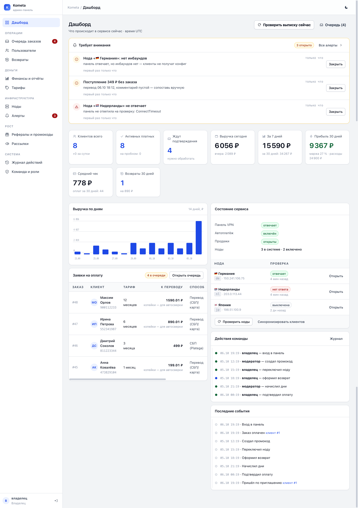
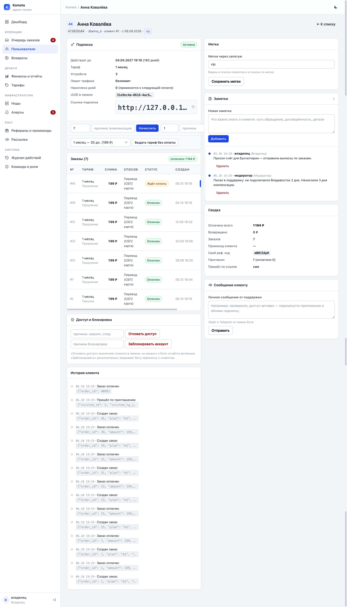

# Админ-панель Kometa: дизайн и логика

Документ описывает веб-панель `/admin` целиком: визуальный язык, роли, сценарии
модератора и то, как это устроено в коде. Макеты — в
[design/renders/](../design/renders), исходники макетов собираются из живых
шаблонов скриптом [design/build.py](../design/build.py).



---

## 1. Что решали

Панель выросла из «страницы с таблицами» в рабочий инструмент на несколько
человек. До этой итерации в ней было пять разделов, один общий пароль и минимум
подсказок: подтвердить оплату можно, а разобрать инцидент — нет. Ключевые
проблемы, которые закрыты:

| Было | Стало |
|---|---|
| Один пароль на всех, действия не подписаны | Три роли (владелец / модератор / поддержка) + журнал «кто что сделал» |
| Без `ADMIN_PANEL_PASSWORD` панель работала без входа | **fail-closed**: без пароля и без учётных записей панель не выполняет действий |
| Подтвердить 20 заявок = 40 кликов | Массовые действия в очереди: выбрать пачкой и подтвердить/отклонить/вернуть |
| Возврат денег оставлял заказ в выручке | Возврат: статус `refunded`, исключение из отчётов, отзыв доступа |
| Списать ошибочно начисленные дни нельзя | Ручные корректировки: начисление, списание, отзыв и возврат доступа |
| Нет карточки клиента — ответ поддержки только через SQL | Карточка: подписка, заказы, события, рефералка, заметки, метки, сообщение клиенту |
| Проблемы видны только в Telegram-чате | Центр алертов в панели: ноды, несопоставленные поступления, ошибки |
| Отчёты — только глазами по таблице | Финансы: оборот, прибыль, каналы, тарифы, возвраты + CSV-выгрузки |
| Тёмная тема без альтернативы | Светлая база + тёмная тема переключателем |

---

## 2. Дизайн-система

**Направление:** Modern minimal (Linear / Vercel). Белая база, синий акцент,
тонкие границы, минимум теней.

**Принципы**

1. **Цвет несёт смысл, а не украшает.** Синий — действие и активное состояние,
   зелёный — деньги и успех, янтарный — «ждёт человека», красный — риск и возврат.
2. **Плотность важнее красоты.** Строка таблицы 44 px, шрифт 13–14 px: в экран
   помещается рабочий объём, а не три карточки.
3. **Цифры выравниваются.** Все суммы и даты — `tabular-nums`: столбец читается
   сверху вниз, разряды не «пляшут».
4. **Никаких внешних зависимостей.** Иконки — инлайновые SVG, шрифты — системные,
   CSS и JS отдаются с самого сервера. Панель работает на localhost без интернета.
5. **Одно место для правды.** Токены и компоненты — в
   [app/web/static/admin.css](../app/web/static/admin.css), одинаковые подписи
   статусов и форматы — в [app/web/ui.py](../app/web/ui.py). Макеты собираются из
   тех же шаблонов, поэтому дизайн не может разойтись с реализацией.

### Палитра

Светлая тема — базовая. Тёмная включается кнопкой в шапке (выбор хранится в
`localStorage`), значения лежат рядом со светлыми и переключаются переназначением
переменных.

| Токен | Светлая | Тёмная | Роль |
|---|---|---|---|
| `--bg` | `#f5f6f8` | `#0b0d12` | фон приложения |
| `--surface` | `#ffffff` | `#14171f` | карточки, сайдбар |
| `--border` | `#e4e7ec` | `#262b36` | границы, разделители |
| `--text` | `#0f172a` | `#e8eaf0` | основной текст |
| `--text-2` | `#475467` | `#a2abbb` | подписи, второй план |
| `--accent` | `#2563eb` | `#4f8dfb` | действия, ссылки, активный пункт |
| `--accent-soft` | `#eff4ff` | `#16233c` | подсветка выбранного |
| `--ok` | `#067647` | `#5ddc9a` | оплачено, активно |
| `--warn` | `#b54708` | `#f3b75f` | ждёт оплаты, внимание |
| `--err` | `#b42318` | `#f88f88` | возврат, блокировка, критично |
| `--info` | `#175cd3` | `#7cb2ff` | пробный доступ, пояснения |

Геометрия: радиусы 4/6/8/12/16, шаг сетки 4 px, тени — только чтобы отделить
слой (`--shadow-xs…lg`). Типографика: системный стек, размеры 12/13/14/15/17/20/28/34.

### Компоненты

`card` (голова / тело / подвал) · `stats` (плитки метрик) · `table.data`
(липкая шапка, hover, зебра через подсветку выбранных) · `badge` и `tag` ·
`btn` (primary / secondary / danger / ghost / sm / icon) · `field`, `input`,
`select`, `textarea`, `checkbox` · `toolbar` и `segmented` (фильтры и вкладки) ·
`flash` (результат действия) · `empty` (пустое состояние с объяснением) ·
`bulkbar` (панель массовых действий) · `pagination` · `timeline` (история
событий) · `alert-row` (алерты) · `kv` (карточка «ключ → значение») ·
`copy-chip` (ссылка с копированием) · `modal` на `<dialog>` · `chart` (инлайновый
SVG-график) · `meter`.

Доступность: контраст не ниже AA, `:focus-visible` у всех интерактивных
элементов, `aria-label` у иконочных кнопок, `prefers-reduced-motion`,
адаптив до телефона (сайдбар превращается в выдвижное меню).

---

## 3. Информационная архитектура

```
Дашборд
Операции        Очередь заказов · Пользователи · Возвраты
Деньги          Финансы и отчёты · Тарифы
Инфраструктура  Ноды · Алерты
Рост            Рефералы и промокоды · Рассылки
Система         Журнал действий · Команда и роли
```

Пункты меню скрываются по правам роли: поддержка не видит «Команду», «Тарифы»,
«Рассылки» и «Журнал» — вместо 403 по клику этих пунктов просто нет.

---

## 4. Роли и права

| Право | Владелец | Модератор | Поддержка |
|---|:--:|:--:|:--:|
| Смотреть очередь, клиентов, ноды, алерты, рефералов | ✅ | ✅ | ✅ |
| Подтверждать и отклонять оплаты (в т.ч. пачкой) | ✅ | ✅ | — |
| Возвраты, списания и начисления дней, блокировка | ✅ | ✅ | — |
| Заметки и метки на клиента, сообщение клиенту | ✅ | ✅ | ✅ |
| Финансы и CSV-выгрузки | ✅ | ✅ | — |
| Ноды: добавление, проверка, выключение, токены | ✅ | — | — |
| Промокоды | ✅ | ✅ | — |
| Тарифы, рассылки, команда и роли | ✅ | — | — |
| Журнал действий | ✅ | ✅ | — |

Роль хранится в подписанной cookie и проверяется на каждом маршруте
(`require(request, "orders.act")`). Ни одно действие не выполняется «на клиенте»:
скрытие кнопки — только удобство, отказ приходит с сервера.

Вход: владелец может входить паролем из `ADMIN_PANEL_PASSWORD` (резервный вход),
остальные — логином и паролем своей учётной записи. Пароли хранятся только
хэшем (PBKDF2-HMAC-SHA256, 240 000 итераций).

---

## 5. Экраны

### Дашборд
Верх — то, что требует человека: алерты (нода не отвечает, поступление без
заказа) и очередь оплат. Ниже — метрики дня (клиенты, активные, выручка,
прибыль, средний чек, возвраты), график выручки за 14 дней, состояние сервиса
(панель, автоплатёж, продажи, ноды) и лента «что делала команда».

### Очередь заказов
Вкладки по статусам со счётчиками, поиск по номеру, сумме и **копейкам**
(набрал `199.13` — нашёл ровно тот заказ), фильтры по способу, типу и датам,
сортировка, пагинация, итог по фильтру. Внизу — панель массовых действий:
отметил заявки, нажал «Подтвердить» — система обработала пачкой и отчиталась,
сколько прошло и что не получилось (по каждой строке отдельно).

### Карточка клиента
Одна страница отвечает на вопрос поддержки: статус и срок подписки, ссылка с
копированием, накопленные дни, заказы с возвратами, история событий и действий
команды, реферальные связи, заметки и метки. Действия рядом: начислить, списать,
выдать тариф без оплаты, отозвать доступ (не блокируя аккаунт), заблокировать,
отправить личное сообщение.



### Возвраты
Две таблицы: «к возврату» (оплаченные заказы с кнопкой «Вернуть деньги» и
причиной) и история возвратов (кто оформил, когда, почему). Возврат убирает
заказ из выручки и отключает доступ — но только если у клиента нет более поздней
оплаты.

### Финансы и отчёты
Оборот, «на руки» после комиссий каналов, прибыль с учётом постоянных расходов,
средний чек, возвраты. График выручки по дням за 7/30/90 дней, разбивка по
каналам платежей и по тарифам. Кнопки выгрузки: заказы, клиенты, журнал (CSV с
BOM и `;` — открывается в Excel без танцев).

### Ноды
Список нод с состоянием последней проверки, инбаундами и панелями, форма
добавления/правки (пустое поле токена не затирает сохранённый), кнопки
«включить/выключить/удалить» с подтверждением, кнопка «Проверить ноды» (пишет
`last_check_at` и поднимает/закрывает алерты). Для поддержки токен маскируется.

### Алерты
Вкладки «Открытые / В работе / Закрытые / Все», у каждого алерта — важность,
вид, счётчик повторов, отпечаток (по нему алерты дедуплицируются) и ссылка на
клиента. Действия: «Взять в работу» и «Закрыть» с пояснением.

### Журнал действий
Кто, что, когда, над кем и с какого IP — с фильтрами по человеку, действию и
датам. Пишутся вход и выход, подтверждения и отклонения, массовые операции,
возвраты, начисления и списания, блокировки, правки нод, промокодов, тарифов,
рассылки, выгрузки и ошибки входа.

### Тарифы, Рефералы и промокоды, Рассылки, Команда
Тарифы правятся без SQL (цена, срок, устройства, трафик, звёзды, порядок;
последний активный тариф выключить нельзя). Промокоды: процент, потолок скидки,
лимит активаций, срок, «только на первую оплату», список применений. Рассылки:
предпросмотр числа получателей по сегментам (активные / истёкшие / пробные /
все), история с прогрессом и остановкой. Команда: создание учётных записей,
смена роли и пароля, защита от потери последнего владельца.

---

## 6. Сценарии модератора

**Утренняя очередь.** Дашборд показывает, сколько заявок ждёт (бейдж в меню),
очередь сортируется по дате, суммы сверяются по копейкам. Обычный случай —
выделить все и нажать «Подтвердить»: клиенты получают сообщение со ссылкой
автоматически.

**«Верните деньги».** Возвраты → найти заказ → «Вернуть деньги» + причина. Заказ
уходит из выручки, доступ отключается, клиент получает уведомление, в журнале
появляется запись с именем того, кто оформил.

**«Пропал интернет, компенсируйте».** Карточка клиента → «Начислить» нужное
число дней с причиной; если подписки ещё нет, дни не теряются, а ложатся в
накопительный баланс и применятся при первой оплате.

**«Подключается с пяти устройств».** Карточка → метка `шеринг`, заметка с
деталями, при необходимости «Отозвать доступ» (аккаунт в боте остаётся живым —
человек может оплатить снова).

**«Пришло 349 ₽, а заказа нет».** В панели поднимается алерт; модератор ищет по
сумме, решает: подтвердить заказ или оформить возврат. Алерт закрывается с
пояснением — история остаётся в журнале.

**Работа вдвоём.** Владелец заводит модератору и поддержке учётные записи.
Модератор делает операции, поддержка отвечает клиентам и пишет заметки, а по
журналу всегда видно, кто подтвердил оплату, кто вернул деньги и кто выключил
ноду.

---

## 7. Что изменилось в коде

```
app/web/admin/            маршруты по доменам (вместо одного admin.py)
├── common.py             доступ по ролям, flash-сообщения, пагинация
├── auth.py               вход, выход, учётные записи
├── dashboard.py          обзор
├── orders.py             очередь, подтверждение, возвраты, массовые действия
├── users.py              клиенты, карточка, заметки, метки
├── finance.py            деньги и выгрузки
├── infra.py              ноды, алерты, журнал
├── growth.py             рефералы, промокоды, тарифы, рассылки
├── team.py               команды и роли
└── exports.py            CSV
app/web/static/admin.css  дизайн-система (светлая и тёмная темы)
app/web/static/admin.js   тема, копирование, массовый выбор, подтверждения
app/web/ui.py             роли, права, подписи статусов, форматы
app/web/templating.py     один Jinja-движок и общие хелперы
app/services/audit.py     журнал действий администратора
app/services/alerts.py    алерты: дедупликация, проверка нод, закрытие
app/services/exporting.py CSV-выгрузки
```

**Схема данных** (создаётся `create_all`, для существующих SQLite-баз колонки
дописываются лёгкими миграциями в `app/db/session.py`):

* `admin_accounts` — учётные записи панели (логин, хэш пароля, роль, tg_id);
* `user_notes` — заметки модераторов о клиенте;
* `alerts` — алерты с дедупликацией по отпечатку;
* `broadcasts` — рассылки, переживающие перезапуск;
* `events` + `actor_name`, `actor_role`, `actor_tg_id`, `source`, `ip` — аудит;
* `orders` + `refunded_at`, `refunded_by`, `refund_note` и статус `refunded`;
* `users.tags` — метки; индекс `orders(status, created_at)`.

**Исправленные баги логики**, найденные по ходу:

* разблокировка больше не превращает пробный доступ в платный;
* оплата от заблокированного клиента не выдаёт доступ автоматически;
* фильтр «заблокированные» смотрит на аккаунт, а не на подписку;
* начисление дней клиенту без подписки кладёт их в баланс, а не отвечает ошибкой;
* значение фильтра `all` не теряется в ссылках (вкладка «Все» больше не ведёт в «ждут оплаты»);
* пустое поле токена ноды не стирает сохранённый токен.

---

## 8. Безопасность

* **fail-closed:** нет ни пароля, ни учётных записей — панель не выполняет действий;
* роли проверяются на сервере, права — на каждом маршруте;
* пароли команды — только хэш; вход ограничен по IP-адресу (10 попыток / 10 минут);
* сессия — подписанная cookie с ролью и именем, `HttpOnly`, `SameSite=Lax`,
  `Secure` при работе по HTTPS, срок жизни `ADMIN_SESSION_HOURS`;
* небезопасные методы дополнительно проверяются на same-origin (вторая линия
  после `SameSite`), выход — только POST;
* панель по умолчанию доступна лишь с localhost (SSH-туннель); за реверс-прокси
  IP берётся из `X-Forwarded-For` **только** при `ADMIN_TRUST_PROXY=true`;
* токены панелей и ссылки-подписки не попадают в URL, журнал и CSV-выгрузки
  (в списках маскируются).

---

## 9. Макеты через Open Design

Макеты — не отдельные картинки, а снимки работающей панели: скрипт поднимает
временную базу с демо-данными, запрашивает страницы через ASGI, вкладывает CSS и
просит Open Design отрендерить PNG встроенным Chromium.

```bash
python3 design/build.py                  # HTML-артефакты в design/screens
python3 design/build.py --render         # + PNG в design/renders
python3 design/build.py --render --lint  # + анти-слоп линтер Open Design
python3 design/build.py --only orders    # одна страница
```

Анти-слоп линтер Open Design: **0 замечаний** на всех 16 макетах (светлая и
тёмная темы, вид с телефона и все разделы).

---

## 10. Проверки

* `python -m pytest` — **829 тестов**, среди них новые:
  `test_admin_roles.py` (роли, fail-closed, аудит, CSRF-проверка),
  `test_admin_ops.py` (возвраты, списания, массовые действия, заметки, метки),
  `test_admin_pages.py` (все страницы под всеми ролями, выгрузки, регресс «Все»),
  `test_admin_export.py` (CSV и агрегаты статистики);
* макеты собираются из живых страниц — если шаблон ломается, сборка падает.

---

## 11. Что осталось за рамками итерации

1. **Очередь несопоставленных поступлений в учёте.** Сейчас такое поступление
   живёт алертом; полноценный реестр `Payment` (с nullable `order_id`) и кнопка
   «зачесть оплату» — отдельная задача.
2. **2FA/TOTP** для входа в панель.
3. **Ротация сессий и «выйти везде»** при смене пароля.
4. **Массовые действия над клиентами** (пачкой начислить/заблокировать сегмент).
5. **Инбокс поддержки** внутри панели: сейчас обращения живут в чате бота,
   в панели есть заметки и личные сообщения.
6. **Графики за длинные периоды** (сейчас 7/30/90 дней на инлайновом SVG).
