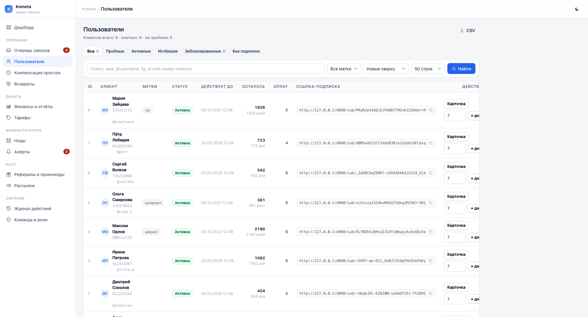
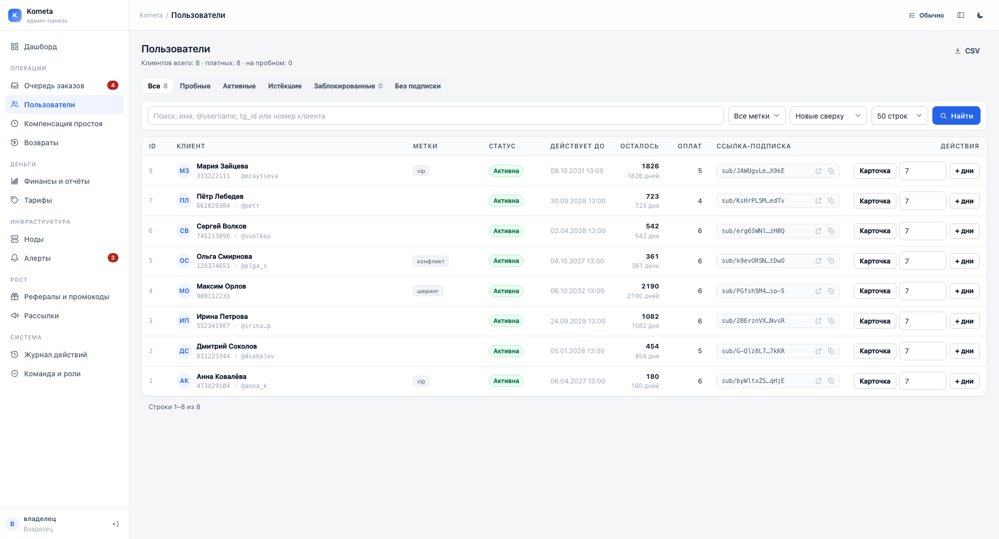
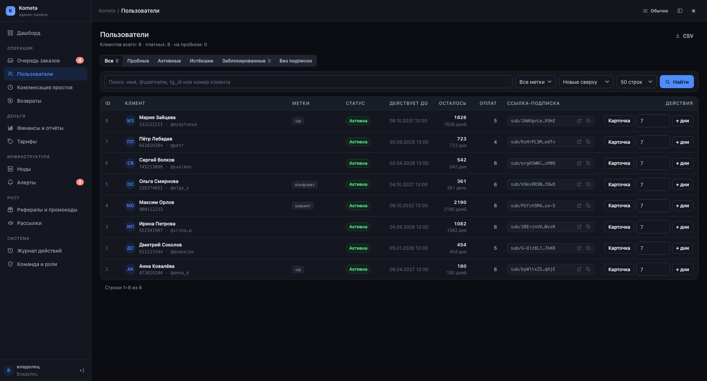
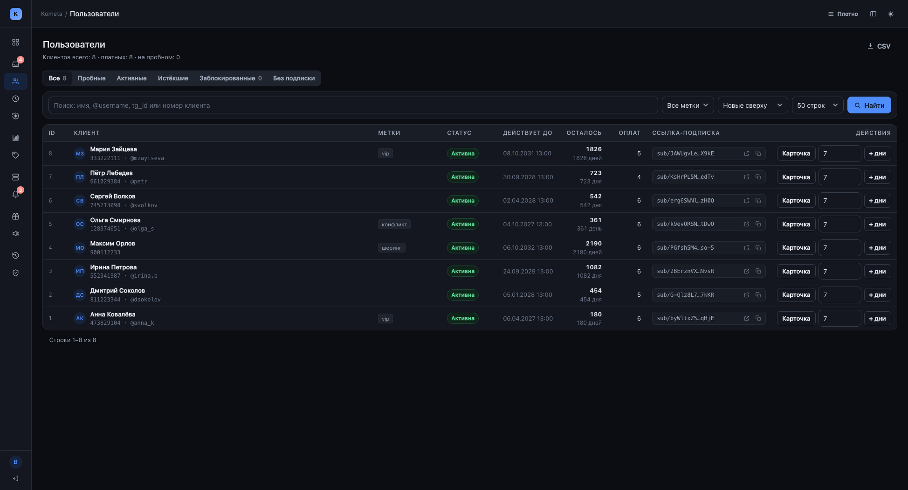
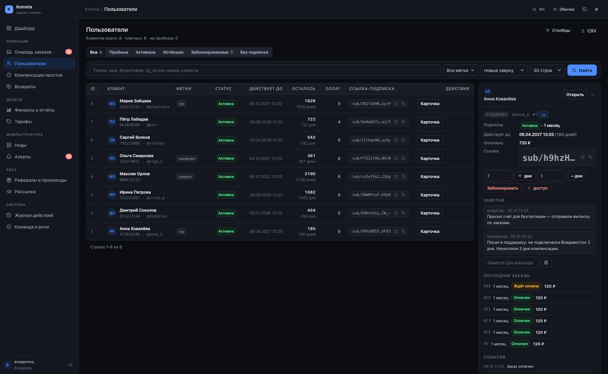
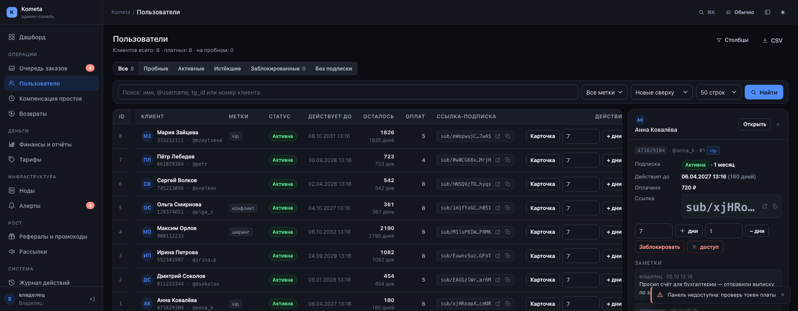
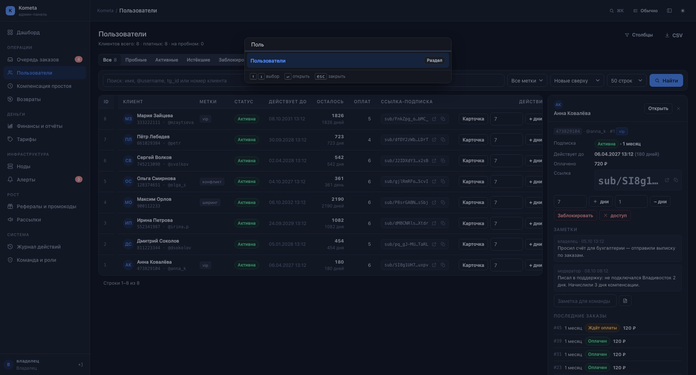

# Дизайн админ-панели под широкий экран — 08.10.2026

Что было не так на рабочем разрешении, что уже исправлено и какие есть варианты
развития. Замеры и рендеры сняты на 1948 CSS px (15″ MacBook в scaled-режиме),
тёмная тема — как в рабочей панели.

**Состав:** §2 — первая итерация (ширина, таблицы, плотность), §4 — вторая
итерация по вашему выбору (карточка сбоку, тосты без перезагрузки, столбцы,
палитра ⌘K), §5 — что ещё можно сделать.

## 1. Проблема в цифрах

Замеры живой вёрстки до правок (Chrome, viewport 1938 px):

| Метрика | Было | Стало |
|---|---|---|
| Ширина контента | 1360 px (жёсткий `max-width`) | 1686 px — вся доступная |
| Пустое место справа | **326 px** | 0 |
| Таблица «Пользователи» | 1344 px в контейнере 1310 px → **горизонтальный скролл** | 1637 px, скролла нет |
| Колонка «Действия» | обрезана на 35 px («ДЕЙСТВ», «+ дн») | видна целиком |
| Ссылка-подписка | 461 px на одну ссылку | 240 px (короткая подпись + открыть + копировать) |
| Высота строки | 93 px (имя в 2–3 строки, кнопки в 2 ряда) | **59 px**, в компактном режиме 51 px |
| Строк в экране 1050 px | ~5 | ~8 (в компактном — 10) |

Две причины: контент был зажат в 1360 px, а длинная ссылка-подписка задавала
ширину столбца и выталкивала «Действия» за край — при **пустых 326 px справа**.
Ровно то, что вы видели: половина экрана пустая, а вкладку надо листать.

## 2. Что уже сделано

### 2.1. Контент занимает весь экран

`.content`: предел 1360 px → 2040 px (ограничение осталось только для
сверхшироких мониторов, чтобы строка не растягивалась на «три метра»), отступы
адаптивные. Файл: [app/web/static/admin.css](../app/web/static/admin.css).

### 2.2. Таблицы перестали уезжать в скролл

* Ссылка-подписка показывается коротко: `sub/2faa1c9e…aUcG` + кнопки
  «открыть» и «скопировать». Полный адрес — в подсказке и в буфере обмена
  (кнопка копирования берёт его из `data-copy`). Помощник `link_label` —
  [app/web/ui.py](../app/web/ui.py).
* Бюджет столбцов задан на заголовках: ровно один «резиновый» — «Клиент»,
  он забирает остаток ширины. Имя и ник больше не ломаются на три строки.
* Действия в одну строку: «Карточка», число дней и «+ дни» не переносятся.
* Метки: показываем первые две + «+N» (полный список — в подсказке).
* Заблокированный клиент помечен и красной полосой строки — читается даже
  когда колонка меток скрыта.

Файлы: [users.html](../app/web/templates/users.html), [orders.html](../app/web/templates/orders.html).

### 2.3. Два регулятора плотности под ваш экран

Кнопки в шапке справа (состояние помнит localStorage, применяется до первой
отрисовки — без мигания):

| Кнопка | Что делает | Когда полезно |
|---|---|---|
| `≡ Обычно` | цикл «Обычно → Плотно → Просторно»: отступы ячеек 10/6/14 px, аватар 30/26 px | «Плотно» — на 15″ в экран входит на треть больше строк; «Просторно» — на внешнем 27″ |
| `▭` (панель) | сворачивает меню в иконную рейку 68 px вместо 252 px | освобождает 184 px под данные, подписи — в подсказках |

### 2.4. Мелочи для скорости работы

* `/` — фокус в поиск, `Esc` — выйти из поиска.
* На 13–14″ второстепенные столбцы («Способ», «Оплачен», «Метки», быстрая
  выдача дней) уходят, чтобы очередь и клиенты не уезжали в скролл; всё это
  остаётся в карточке.
* Сетки дашборда на широком экране — 2–3 панели в ряд, метрики — 6 в ряд
  (раньше расползались в десяток узких колонок).
* Карточка «Заявки на оплату» больше не скроллится: из неё убран «Способ»,
  «Отклонить» стало иконкой, дата заказа переехала под тариф, а на узкой
  карточке «Тариф» скрывается через **container query** (ширина карточки
  зависит от сетки, а не от окна, поэтому media queries там бессильны).

## 3. Как выглядит

| Экран | Файл |
|---|---|
| Было (1948 px, светлая) |  |
| Стало (1948 px, светлая) |  |
| Стало (тёмная, как в работе) |  |
| Максимум данных: рейка + «Плотно» |  |

Полный набор макетов пересобран через Open Design: `design/screens/*` → `design/renders/*`
(`.venv/bin/python design/build.py --render`).

## 4. Что сделано во второй итерации (по вашему выбору)

Четыре пункта, отмеченные в предыдущем разговоре, — сделаны.

### 4.1. Мастер-деталь: карточка клиента справа

Клик по строке (или по имени) открывает карточку клиента **сбоку**: подписка,
ссылка, быстрые действия (дни, блокировка, отзыв доступа), заметки, последние
заказы и события. Список остаётся на месте — не нужно возвращаться «назад»
после каждого просмотра. Карточка липкая, скроллится отдельно от таблицы.

* Ссылка работает и без JS: `?card=<id>` — обычный GET, состояние фильтров
  сохраняется.
* С JS содержимое подменяется на месте (`history.pushState`), кнопка «×»
  закрывает карточку, «Открыть» ведёт на полную страницу клиента.
* Действия из карточки — те же маршруты, что и раньше: права проверяет сервер.



### 4.2. Тосты и действия без перезагрузки

Любая POST-форма панели (подтвердить заказ, начислить дни, заблокировать,
закрыть алерт, запустить рассылку) уходит через `fetch`: сервер отвечает
JSON-ом, панель показывает тост в углу и **обновляет содержимое на месте** —
страница не перезагружается, позиция скролла сохраняется, выбранные фильтры
не сбрасываются.

* Серверная часть — одна точка: `flash_redirect` отдаёт словарь, если запрос
  пришёл с заголовком `X-Panel-Ajax`. Ни один маршрут менять не пришлось.
* Без JS всё работает как раньше: 303 + сообщение в cookie (есть тест,
  который это фиксирует).
* Если сервер ответил не JSON (например, страница отказа) — форма отправляется
  обычным способом.



### 4.3. Липкие и настраиваемые столбцы

* **Липкие:** при горизонтальной прокрутке «Заказ» и чекбокс (в очереди) или
  «ID» и «Клиент» (в списке) остаются на месте.
* **Настраиваемые:** кнопка «Столбцы» в шапке страницы — галочки «что
  показывать». Набор хранится в `localStorage` отдельно для клиентов и
  заказов, поэтому у владельца и модератора списки могут выглядеть по-разному.

### 4.4. Командная палитра ⌘K

Одно поле вместо хождения по меню: `⌘K` (или `Ctrl+K`, или кнопка поиска в
шапке) — и можно ввести «Мария», «8300512489», «47» или «ноды». Показывает
разделы (только доступные роли), клиентов и заказы; `↑`/`↓` — выбор, `↵` —
открыть, `esc` — закрыть. Данные ищет новый эндпоинт `/admin/search`, который
уважает те же права, что и страницы (поддержка не увидит заказов).



## 5. Что предлагается дальше

Отсортировано по отношению «польза / трудозатраты». Пункты 4.1–4.4 сделаны,
здесь — то, что осталось.

### Дёшево и заметно (1–3 часа каждое)

1. **Автотёмная тема** по системной (`prefers-color-scheme`) с ручным
   переключателем поверх — на Mac это ожидаемое поведение.
2. **Счётчик «выбрано» и «Подтвердить всё видимое»** в очереди заказов:
   одна кнопка вместо выделения 50 строк чекбоксами.
3. **«+ дни» одной кнопкой.** Сейчас в строке клиента стоит поле «дней» и
   кнопка; на 13–14″ это поле скрывается, чтобы влез «Клиент». Компактная
   кнопка «+7» с маленьким поповером оставит быструю выдачу дней на любой
   ширине экрана.
4. **Пресеты фильтров:** «ждут оплаты сегодня», «истекают на этой неделе»,
   «с меткой конфликт» — сохраняются вкладками рядом с существующими.

### Средние (день-два)

5. **Быстрые действия в строке заказа** прямо в очереди: «подтвердить»,
   «вернуть», «карточка» — уже есть; добавить «открыть в боте» и копирование
   реквизитов для ручных переводов.
6. **Дашборд-режим «смена»:** экран на весь день — крупные метрики, очередь,
   алерты, без прокрутки (по сути «второй монитор» из одного экрана).
7. **Карточка клиента в очереди заказов:** сейчас мастер-деталь есть только в
   списке клиентов; в заказах она уместна так же (клиент и его история).
8. **Горячие клавиши списков:** `j`/`k` — вверх/вниз по строкам, `↵` —
   открыть карточку, `x` — выбрать чекбокс. Работа с очередью без мыши.

### Крупные (3+ дней)

9. **Рабочий стол поддержки:** карточка в правой колонке + история обращений +
   шаблоны ответов в один клик (сейчас заметка и сообщение — вручную).
10. **Мобильный режим «на бегу»:** таблицы превращаются в карточки (сейчас на
    телефоне горизонтальный скролл). Нужен, только если отвечаете с телефона.
11. **Тёмная тема и плотность по умолчанию** — чтобы панель сразу открывалась
    в вашем сценарии, без настройки.

## 6. Что не менялось

Логика прав и маршруты — прежние: добавлены только два новых адреса
(`GET /admin/search` для палитры и `?card=<id>` у списка клиентов) и режим
ответа JSON для ajax-запросов. Все действия по-прежнему проверяют права на
сервере и пишутся в журнал; обычная работа без JS сохранена и покрыта тестами
(`tests/test_admin_ajax.py`, `tests/test_admin_search.py`).

## 7. Как выкатить

```bash
cd "/Users/egor/Downloads/VPN servise"
.venv/bin/python -m pytest -q                 # тесты панели и веба
.venv/bin/python design/build.py --render     # пересобрать макеты (опционально)
```

Изменённые файлы (только они):

| Файл | Что внутри |
|---|---|
| `app/web/static/admin.css` | ширина контента, плотность, бюджет столбцов, рейка меню, адаптив |
| `app/web/static/admin.js` | плотность, рейка, горячие клавиши |
| `app/web/templates/base.html` | кнопки в шапке, подсказки в меню, палитра, тосты, восстановление состояния |
| `app/web/templates/users.html`, `orders.html` | бюджет столбцов, липкие столбцы, короткая ссылка, скрытие второстепенного |
| `app/web/templates/_user_drawer.html` | боковая карточка клиента (мастер-деталь) |
| `app/web/templates/_icons.html` | иконки «панель» и «плотность» |
| `app/web/admin/search.py` | эндпоинт `/admin/search` для палитры |
| `app/web/admin/users.py` | `?card=<id>` и общий сборщик данных карточки |
| `app/web/admin/common.py` | JSON вместо редиректа для ajax-запросов |
| `app/web/sub.py` | middleware, помечающий ajax-запросы панели |
| `app/web/ui.py`, `app/web/templating.py` | помощник `link_label`, разделы палитры |

Тесты: `tests/test_admin_search.py` (палитра), `tests/test_admin_ajax.py`
(JSON-ответы и сохранение обычного поведения). Полный прогон — 1201 тест,
0 падений.

На боевом сервере панель отдаёт эти файлы как статику — достаточно выкатить
изменённые файлы и обновить страницу (CSS/JS отдаются без версии, поэтому
может понадобиться hard reload: ⌘⇧R).
